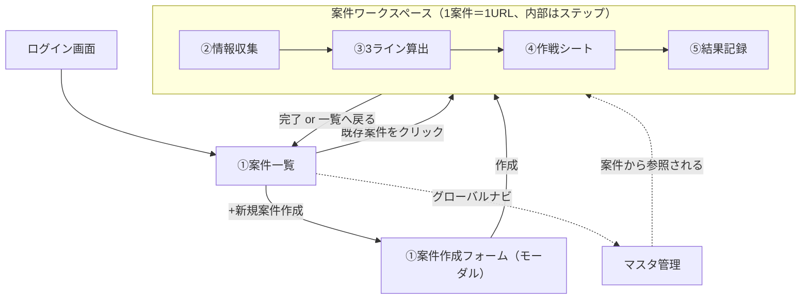

# デザインガイド — ふりぃらじかるず 購買交渉支援アプリ（MVP）

- 対象: 購買担当者が毎日使う業務アプリ（デスクトップ優先。スマホ対応はMVP対象外・将来機能）
- 作成: マイメロディ（デザイン/UX） / 承認: 統括 mitsuru さん（2026-07-10）
- 参照: `03_機能要件認識合わせ資料_draft-v1.md` §2, §5 / `01_要件定義書_draft-v2.md` §2
- 実装者: イーブイ（フロント実装。技術選定は Next.js App Router + Tailwind, Azure Static Web Apps [要件定義書 §4]）
- 本書のコンポーネント名・状態設計は、この粒度のまま実装に落とせることを狙っています。不明点があれば実装前にマイメロディまで確認してください。

---

## 0. この画面デザインが解く課題

RFPの核心は「業務の1周（A交渉前 → B交渉中 → C交渉後）が、次の交渉に活きる」という**判断継承ループ（BR-10）**です[機能要件資料 §2.1]。デザイン上の最重要課題は次の2つです。

1. **迷子にしない**: ①〜⑤の5画面をバラバラな独立ページにすると、担当者は「今この案件のどの段階か」を見失う。→ **案件ワークスペース**という1つの入れ物の中に①〜⑤をステップとして内包し、常時ステップインジケーターを出す。
2. **数字で判断させる**: 3ライン（目標/着地/撤退）と年間影響額が交渉の武器になる[機能要件資料 §2.1 B]。→ 数字は等幅・大きく・色で瞬時に区別できるようにする。装飾より判読性。

---

## 1. デザイン原則

### 1.1 優先順位

業務アプリとして、**視認性 > 入力効率 > 数字の読みやすさ > 装飾性** の順で判断する。かわいさ・独自性より「毎日使う人が疲れないこと」を優先する。

- 情報密度は高めでよい（テーブル・カードは詰め気味、ただし窮屈にはしない＝下記スペーシング参照）。
- 1画面1目的。②情報収集のような集約画面以外は、担当者が今すべき入力・判断を1つに絞る。
- AIが関わる箇所（過去経緯参照・交渉ポイント生成）は必ず「担当者の判断材料」であって「AIが決める」ものではないと分かる見せ方にする（RFPの前提 [機能要件資料 §4]）。Citation（引用元）を必ず添える。

### 1.2 カラートークン（Tailwind前提）

Tailwind標準パレットをそのまま使う（カスタムパレットを増やさない＝実装・保守コスト優先）。

| トークン | 用途 | Tailwindクラス例 |
|---|---|---|
| Primary | ナビ・主要ボタン・フォーカス | `blue-600`（通常） / `blue-700`（hover） / `blue-500`（focus ring） |
| Surface | 画面背景 | `slate-50` |
| Card / Panel | カード・パネル背景 | `white` + `border-slate-200` |
| Text 本文 | 本文・ラベル | `slate-900` |
| Text 補助 | 補助説明・プレースホルダ | `slate-500` |
| Border | 罫線・区切り | `slate-200`（弱） / `slate-300`（テーブル外枠） |
| 成功・目標達成 | 目標ライン・完了ステータス | `emerald-600` |
| 警告・着地相当 | 着地ライン・要確認 | `amber-600` |
| 危険・撤退 | 撤退ライン・エラー | `red-600` |
| 情報 | AI生成中・Citation | `indigo-600`（AIが関わる要素はPrimaryと視覚的に区別するため青系より紫寄りに） |

> **なぜ3ラインに信号色（緑/黄/赤）を当てるか**: 目標=安全に進めてよい水準、着地=現実的な落とし所、撤退=これ以上譲れない境界、という意味づけが交通信号のメンタルモデルと一致し、担当者が金額を読む前に色で状況を掴めるため。ただし色だけに依存せず、ラベル文字（「目標」「着地」「撤退」）とアイコンを必ず併記する（色覚多様性への配慮、アクセシビリティ §1.5）。

### 1.3 タイポグラフィ

- 本文フォント: `font-sans`（Noto Sans JP を第一候補、システムフォントへのフォールバックを許容）。
- **数値（単価・金額・％・案件番号）は等幅数字にする**: Tailwindの `tabular-nums` ユーティリティ（`font-variant-numeric: tabular-nums`）を必ず当てる。桁が変わっても列が揃い、テーブル・3ラインカードでの比較が一瞬でできるため業務アプリでは必須。
  - 例: `<span class="tabular-nums">¥620/kg</span>`
- 見出し階層:
  - 画面タイトル: `text-2xl font-bold`
  - セクション見出し: `text-lg font-semibold`
  - カードラベル・補助テキスト: `text-sm text-slate-500`
  - テーブル本文: `text-sm`（行数を稼ぐため本文より一段小さく）
- 行間: 本文 `leading-normal`、テーブル `leading-tight`（詰めて一覧性を優先）。

### 1.4 スペーシング・グリッド

- Tailwind標準スケール（4px刻み）に準拠、独自値を増やさない。
- コンテンツ最大幅 `max-w-7xl mx-auto`、左右パディング `px-6`。
- カード間・グリッド間隔 `gap-4`〜`gap-6`。フォーム項目間 `space-y-4`。セクション間 `space-y-8`。
- テーブル行の高さは詰め気味（`py-2`程度）だが、タップ/クリック領域は後述のアクセシビリティ基準を満たす。
- レスポンシブ: MVPはデスクトップ最適化が主（1280px〜を基準グリッドに設計）。タブレット幅（768px〜)で崩れない程度の最低限のブレークポイント対応のみ行う。スマホ対応は実装しない（将来機能 [機能要件資料 §4]）。

### 1.5 アクセシビリティ基準（必須）

- コントラスト比: 本文文字は **4.5:1以上**、大きな文字・アイコンのみの意味伝達は **3:1以上**。上記カラートークンの組み合わせ（`slate-900` on `white`, `white` on `blue-600` 等）はこの基準を満たすものだけを採用する。
- タップ／クリック領域: 最小 **44×44px**（テーブル行内の小さいアイコンボタンも同様。パディングで確保する）。
- キーボード操作: すべての操作がTabで到達可能。フォーカス時は `focus-visible:ring-2 ring-blue-500 ring-offset-2` を必ず表示。モーダルはEsc で閉じる、Enter で主要アクション実行。
- スクリーンリーダー: フォーム要素は `<label>` と `for` を必ず対応させる。非同期進捗（AI生成中など）は `role="status" aria-live="polite"` で読み上げられるようにする。色だけで意味を伝えない（§1.2 の注記）。

---

## 2. 情報設計 — 案件ワークスペースという入れ物

### 2.1 全体のサイトマップ（画面遷移）



**設計判断**: ①だけが独立画面（案件の入口＝一覧・検索・新規作成）。②〜⑤は「案件ワークスペース」という1つの画面群にまとめ、共通ヘッダーに**ステップインジケーター**を常設する。これにより「今どの段階か」「前後の段階に何が入っていたか」が常に見える状態になり、A→B→Cの業務の1周が画面遷移の中で迷子にならない。

### 2.2 案件ワークスペース共通ヘッダー（②〜⑤で共通表示）

```
+----------------------------------------------------------------------+
| ← 一覧へ   No.500001  丸紅畜産 / 鶏もも肉（ブラジル産・冷凍）         |
+----------------------------------------------------------------------+
| ● 情報収集 ──── ● 3ライン算出 ──── ○ 作戦シート ──── ○ 結果記録     |
|   (完了/緑)        (現在地/青太字)     (未着手/灰)        (未着手/灰)  |
+----------------------------------------------------------------------+
```

- ステップは完了=`emerald-600`塗り○、現在地=`blue-600`太枠、未着手=`slate-300`灰、のように状態を色＋アイコン（チェックマーク／現在地ドット）の両方で示す（色のみに依存しない）。
- 各ステップ名はクリック可能（前段階を後から見返す・修正する動線を塞がない）。ただし未到達ステップ（まだ③まで来ていないのに④へ飛ぶ等）はクリック不可＋グレーアウト＋ツールチップ「先に3ライン算出を完了してください」。

---

## 3. 画面別レイアウト定義

各画面について: ワイヤーフレーム／主要コンポーネント／状態（空・ローディング・エラー）／次画面への導線、の順に記載します。

### 3.0 ログイン画面

```
+----------------------------------------+
|              [ロゴ]                     |
|     ふりぃらじかるず 購買交渉支援        |
|                                          |
|   テナント: [__________________]        |
|   ID:       [__________________]        |
|   Password: [__________________]        |
|              [ ログイン ]                |
|   ------------ または ------------       |
|      [ Microsoft でサインイン ]          | ← Entra External ID [要件定義書 N-02]
+----------------------------------------+
```

- コンポーネント: `LoginForm`（テナント/ID/PW） + `SSOButton`
- 状態: エラー（認証失敗時はフォーム下に赤文字でメッセージ、原因を推測させない一般文言）／ローディング（ボタン内スピナー、二重送信防止で押下後ボタンを`disabled`）
- 遷移: 成功 → ①案件一覧

### 3.1 画面① 案件作成／案件一覧

案件の入口。FR-01（新規登録）・FR-10（検索・呼び出し）を1画面に集約[機能要件資料 §2.2]。

```
+------------------------------------------------------------------------+
| [ロゴ] 購買交渉支援          [グローバル検索]           [氏名 ▼]       |
+------------------------------------------------------------------------+
| 案件一覧 | マスタ管理                              [＋ 新規案件作成]   |
+------------------------------------------------------------------------+
| フィルタ: [企業 ▼] [商材 ▼] [ステータス ▼] [期間 ▼]      [検索実行]   |
+------------------------------------------------------------------------+
| 案件番号    | 企業      | 商材            | ステータス  | 更新日 | 担当 |
|-------------|-----------|-----------------|-------------|--------|------|
| No.500001   | 丸紅畜産  | 鶏もも肉(冷凍)  | ● 交渉中    | 07/09  | 田中 |
| No.499998   | 伊藤忠食品| 豚バラ          | ○ 交渉前    | 07/08  | 佐藤 |
| No.499987   | ...       | ...             | ✓ 完了      | 07/01  | 田中 |
| （行クリック → 案件ワークスペースへ）                                    |
+------------------------------------------------------------------------+
|                      < 1  2  3 … 10 >   全123件中 1–20件を表示          |
+------------------------------------------------------------------------+
```

- 主要コンポーネント: `DataTable`（§4.1）、`FilterBar`、`StatusBadge`（交渉前=灰／交渉中=青／完了=緑）
- 状態
  - **空**: 案件0件（初回利用・検索結果0件）→ テーブルの代わりに中央にイラスト風アイコン＋「案件がまだありません」＋`＋新規案件作成`ボタンを大きく表示。検索結果0件の場合は「条件に一致する案件がありません」＋フィルタをリセットする導線。
  - **ローディング**: テーブル行をスケルトン（灰色バー）で6〜8行分表示。
  - **エラー**: テーブル位置に赤枠バナー「案件の読み込みに失敗しました」＋`再読み込み`ボタン。
- 遷移: 「＋新規案件作成」→ 作成モーダル（企業・商材・提出見積・時期を入力、保存で案件ワークスペース②へ遷移）／行クリック → 案件ワークスペース（最後にいたステップを開く）

### 3.2 画面② 情報収集

相場・過去経緯・自社計画を**1画面に集約**する（要件の明示指定 [機能要件資料 §5]）。3カラムの横並びレイアウトとし、タブで隠さない（同時に見比べながら③へ進む判断材料にするため）。

```
[ワークスペース共通ヘッダー: ● 情報収集(現在) ── ○ 3ライン算出 ── ○ 作戦シート ── ○ 結果記録]
+------------------------+------------------------+------------------------+
| 相場情報                | 過去経緯（自動参照）     | 自社計画               |
|                         |                         |                        |
| 直近相場: ¥620/kg       | ▸ No.499801（丸紅畜産・ | 目標原価率  [___]%     |
|          (tabular-nums) |   鶏もも肉／2026Q1）    | 計画仕入単価 [___]円/kg |
|                         |   決着 ¥598/kg           | 月次発注量  [___]kg    |
| [手入力] [CSV取込 ⬆]    |   [引用元 📎 2件]        | 許容上限   [___]円/kg  |
|                         |                         |                        |
| 取込結果: 12件正規化済み | ▸ No.499650（...）      | [保存]                 |
| （日付・%表記ゆれ自動補正）| [もっと見る]             |                        |
+------------------------+------------------------+------------------------+
|                              [次へ：3ライン算出 →]                       |
+---------------------------------------------------------------------------+
```

- 主要コンポーネント: `RateInputPanel`（手入力＋CSV取込）、`PastCaseList`（`CitationBadge`内包、§4.4）、`CompanyPlanForm`
- 状態
  - **空（過去経緯なし）**: 「過去取引なし」バッジ＋「この組み合わせでの交渉履歴はまだありません」の説明文（同業他社決着の参考表示はMVP対象外なので出さない [機能要件資料 §4]）。
  - **ローディング（過去経緯検索中）**: KRE検索は非同期・目標応答3秒以内[要件定義書 N-04]。3秒未満で返る想定だが、`PastCaseList`はスケルトンカード2〜3枚＋`role="status"`の進捗テキスト「関連する過去案件を検索中…」を表示。
  - **エラー**: 過去経緯パネルのみ部分エラー（相場・自社計画の入力は継続可能にする＝1機能の失敗で画面全体を止めない）。「過去経緯の取得に失敗しました `再試行`」。
  - **CSV取込エラー**: 取込ボタン直下に「3行目: 日付形式を認識できません」のように行単位のエラー明細を出す。
- 遷移: 「次へ：3ライン算出→」（相場・自社計画の必須項目未入力時はボタンを`disabled`＋理由をツールチップ表示）

### 3.3 画面③ 3ライン算出

本アプリの顔となる画面。3ラインカードを主役に据える（§4.3で詳細仕様）。

> **算出値について（2026-07-10 更新・イーブイ）**: 下図の金額は算出正本 `CALC_RULE_V1`
> （`backend/app/db/seams.py` L78-107）で再計算した値に更新しました。初版の例示値
> （目標¥580/着地¥605/撤退¥625）は暫定式に基づくもので正本式と不整合だったため差し替えています。
> 例のサンプル入力（No.500001: 相場¥620・過去最安/平均¥598・計画¥615・許容上限¥625・現行¥610・相場前年比+3%）では、
> 目標=max(620, 0.95×598)=**620**、撤退=min(625, 610×1.05)=**625**、
> 着地=clamp(0.5×598+0.3×615+0.2×620=607.5, 620, 625)=**620** となります（相場上昇局面では目標が相場に張り付き、着地が目標に収束することがある）。

```
[ワークスペース共通ヘッダー: ✓ 情報収集 ── ● 3ライン算出(現在) ── ○ 作戦シート ── ○ 結果記録]
+---------------------------------------------------------------------------+
|  +----------------+   +----------------+   +----------------+            |
|  | ● 目標          |   | ● 着地          |   | ● 撤退          |            |
|  | (emerald)       |   | (amber)         |   | (red)           |            |
|  |                 |   |                 |   |                 |            |
|  |  ¥620/kg        |   |  ¥620/kg        |   |  ¥625/kg        |            |
|  |  (text-3xl,     |   |  (text-3xl,     |   |  (text-3xl,     |            |
|  |   tabular-nums) |   |   tabular-nums) |   |   tabular-nums) |            |
|  |                 |   |                 |   |                 |            |
|  |  自動算出値      |   |  自動算出値      |   |  自動算出値      |            |
|  |  [✎ 手修正する]  |   |  [✎ 手修正する]  |   |  [✎ 手修正する]  |            |
|  +----------------+   +----------------+   +----------------+            |
|  ※手修正クリック時: カード内に金額入力欄＋「修正理由」必須テキストエリアが展開 |
+---------------------------------------------------------------------------+
| 年間影響額試算（対計画・年間発注量 96,000kg）                              |
|   目標達成時: 対計画 −¥48万／年　　着地時: 対計画 −¥48万／年               |
|   （相場が計画単価を上回るため対計画はマイナス。プラスは emerald / マイナスは red で着色） |
+---------------------------------------------------------------------------+
|                          [次へ：作戦シート生成 →]                          |
+---------------------------------------------------------------------------+
```

- 主要コンポーネント: `ThreeLineCard` × 3（§4.3）、`AnnualImpactSummary`
- 状態
  - **ローディング（算出式適用中）**: カード内の金額部分をスケルトンにし「算出中…」。計算式はサーバー側処理だが体感即時（AI不使用、単純計算式 [機能要件資料 §3.2]）のため長時間ローディングは想定しない。1秒超える場合のみスピナー表示。
  - **エラー**: 算出に必要な入力（②の自社計画等）が不足している場合、カードは算出値の代わりに「②自社計画の入力が必要です `②へ戻る`」を表示。
  - **手修正時のバリデーション**: 修正理由が未入力のまま保存しようとするとテキストエリアを赤枠にしフォーカス。
- 遷移: 「次へ：作戦シート生成→」（3ライン確定後に活性化）

### 3.4 画面④ 作戦シート

定型フォーマットの出力（FR-07）と、AIによる交渉ポイント・シナリオ生成（FR-08）を分けて見せる。

```
[ワークスペース共通ヘッダー: ✓ 情報収集 ── ✓ 3ライン算出 ── ● 作戦シート(現在) ── ○ 結果記録]
+---------------------------------------------------------------------------+
| 作戦シート プレビュー（定型フォーマット）                                   |
|  案件概要／3ライン／相場根拠／過去経緯サマリ を自動流し込み                 |
|  [PDF出力は将来機能のためボタンなし [機能要件資料 §4]]                     |
+---------------------------------------------------------------------------+
| 交渉ポイント・シナリオ（AI生成）           [🤖 AI下書き・要確認]           |
|                                                                             |
|  生成前: [ AIで交渉ポイントを生成する ] ボタンのみ表示                     |
|                                                                             |
|  生成中: ⣾ 過去事例を検索中…                                              |
|          ⣾ 関連する交渉の文脈を構築中…                                    |
|          ⣾ 交渉シナリオを生成中…                                          |
|          （ステップ型プログレス、role="status" aria-live="polite"）        |
|                                                                             |
|  生成後:                                                                   |
|   ・交渉ポイント1: 為替影響を踏まえた根拠提示 … [📎引用元1] [📎引用元2]     |
|   ・交渉ポイント2: 長期契約による数量メリット訴求 … [📎引用元3]             |
|   シナリオ文（自由記述, 編集可）: [_________________________]              |
|   [🔁 再生成]  [この内容で保存]                                            |
+---------------------------------------------------------------------------+
```

- 主要コンポーネント: `StrategySheetPreview`、`AiGenerationPanel`（§4.5）、`CitationBadge`（§4.4）
- 状態
  - **未生成**: CTA「AIで交渉ポイントを生成する」のみ。
  - **生成中（非同期）**: ステップ型プログレス表示（検索→文脈構築→生成の3段階、KREのretrieve→本体プロンプト生成の処理実態[要件定義書 §5.2]に対応）。想定超過時（目安10秒以上）は「もう少しお待ちください…」に文言を変える。
  - **生成エラー**: 「生成に失敗しました。もう一度お試しください `再試行`」。担当者が下書き無しでも作戦シート自体は保存できるようにする（AI生成失敗が業務を止めない）。
  - **生成後は編集可能**: あくまで下書きという位置づけを明示するため、生成結果には常時「🤖 AI下書き・要確認」バッジを表示し、シナリオ文はテキストエリアとして編集可能にする。
- 遷移: 「保存して結果記録へ」相当のCTA、または一覧へ戻り後日再開も可（保存は都度）

### 3.5 画面⑤ 結果記録

```
[ワークスペース共通ヘッダー: ✓ 情報収集 ── ✓ 3ライン算出 ── ✓ 作戦シート ── ● 結果記録(現在・最終)]
+---------------------------------------------------------------------------+
| 決着結果                                                                   |
|  決着単価 [¥_____/kg]   納入時期 [______]   支払条件 [______]              |
|  見積比（自動計算）: -3.2%      目標達成度（自動計算）: 92%                |
|         (tabular-nums, 目標達成度は emerald/amber/red で閾値着色)          |
+---------------------------------------------------------------------------+
| 決着理由（変動理由タグ・必須・複数選択可）                                  |
|  [↑ 為替変動] [↑ 需給逼迫] [↓ 長期契約] [↓ 数量拡大] [± 品質調整] …(10種) |
|   （↑=上げ要因/↓=下げ要因/±=両方向、色ではなく矢印記号で方向を示す）        |
+---------------------------------------------------------------------------+
| 所感・申し送り（自由記述）                                                 |
|  [________________________________________________]                      |
+---------------------------------------------------------------------------+
|                        [ 保存して案件を完了 ✓ ]                           |
+---------------------------------------------------------------------------+
```

- 主要コンポーネント: `ResultForm`、`ReasonTagSelector`（変動理由マスタ10種、方向アイコン付き）、`AutoCalcField`（見積比・達成度）
- 状態
  - **空**: 初回は全項目未入力、CTAは`disabled`（決着単価・決着理由は必須）。
  - **保存中**: ボタン内スピナー＋disabled（二重送信防止）。
  - **エラー**: 保存失敗時はフォーム上部に赤バナー、入力内容は保持（再送信可能にする）。
  - **完了後**: 案件ステータスが「完了」に変わり、①一覧のStatusBadgeが緑`✓ 完了`になる。次回、同一商材×取引先の新規案件で自動参照される（BR-10、②のPastCaseListに反映）[機能要件資料 §2.1]。
- 遷移: 保存 → ①案件一覧へ戻る（完了バナーをトースト表示）

### 3.6 マスタ管理

グローバルナビからいつでもアクセス可能な独立エリア（案件ワークスペースの外）。

```
+------------------------------------------------------------------------+
| マスタ管理                                                              |
+------------------------------------------------------------------------+
| [商材] [規格] [取引先] [変動理由] [インフォマート分類]  ← サイドタブ      |
+------------------------------------------------------------------------+
| 検索: [______________]                          [＋ 新規登録]           |
+------------------------------------------------------------------------+
| コード   | 名称        | 分類       | 更新日   |            [編集][削除] |
|----------|-------------|------------|----------|--------------------------|
| ...      | ...         | ...        | ...      |                          |
+------------------------------------------------------------------------+
```

- 主要コンポーネント: `DataTable`（§4.1 と共通）、`MasterEditForm`（モーダル）
- 状態: 空／ローディング／エラーは①案件一覧と同一パターンを踏襲（一貫性のため新規パターンを作らない）。
- 備考: 新規取引先の登録はMVP対象外[機能要件資料 §4]のため、「取引先」タブは参照・編集のみで新規追加ボタンは非表示（または権限ロール=管理者のみ表示、要キャタピー確認）。インフォマート分類は2,492件[要件定義書 §3]と大量のため、検索必須・仮想スクロールまたはサーバーサイドページネーション前提でイーブイに実装してもらう。

---

## 4. 共通コンポーネント仕様

### 4.1 DataTable（テーブル）

- 用途: ①案件一覧、マスタ管理、②過去経緯の簡易一覧
- 構成: ヘッダー行（ソート可能列は`↕`アイコン）／本文行（`hover:bg-slate-50`、行全体クリックで詳細へ）／フッター（ページネーション）
- 数値列は右寄せ＋`tabular-nums`。ステータス列は`StatusBadge`。
- 空／ローディング／エラーの3状態は§3.1のパターンを共通コンポーネントのpropsとして持つ（`state: 'empty' | 'loading' | 'error' | 'ready'`）。

### 4.2 フォーム（Form）

- ラベルは入力欄の上に配置（横並びラベルは業務アプリでも視線移動が増えるため採用しない）。
- 必須項目は赤い`*`をラベル末尾に付与し、`aria-required="true"`。
- インラインバリデーション: blur時にチェックし、エラーは入力欄直下に赤文字＋赤枠（`border-red-500`）。エラーメッセージは具体的に（「入力してください」ではなく「決着単価を入力してください」）。
- 保存ボタンは画面右下または画面下部に固定配置し、保存中は`disabled`＋スピナー。

### 4.3 ThreeLineCard（3ラインカード）— 本アプリの顔

これが最も重要な独自コンポーネントです。要件（目標/着地/撤退＋手修正＋理由記録＋年間影響額）をすべて満たすことが必須条件。

**Props設計（イーブイ向けの実装ヒント）**

```
ThreeLineCard {
  type: 'target' | 'landing' | 'walkaway'  // 目標／着地／撤退
  value: number                             // 円/kg
  isEdited: boolean                         // 手修正済みか
  editReason?: string                       // 手修正時は必須
  colorToken: 'emerald' | 'amber' | 'red'   // typeに1:1対応、決め打ちでよい
}
```

- 色トークンは`type`に応じて固定（目標=emerald / 着地=amber / 撤退=red）。担当者が変更できないようにする（意味の一貫性を保つため）。
- 金額表示は`text-3xl font-bold tabular-nums`。3枚横並びで、金額の桁位置が視覚的に揃うようにカード幅は等幅固定。
- `isEdited=true`の場合、カード右上に「✎ 修正済み」の小バッジを表示し、ホバー/タップで`editReason`をツールチップ表示（一覧性を保ちつつ理由を追跡可能にする）。
- モバイル等で横並びが崩れる場合は縦積みに切り替わってよいが、MVPはデスクトップ優先のため優先度低。

### 4.4 CitationBadge（引用元表示）

過去経緯参照（FR-03）・AI生成（FR-08）はいずれもKREから`citations`を受け取る構造[要件定義書 §5.3 `RetrieveResult`]。UI側は共通コンポーネントとして統一する。

- 表示: `📎 引用元 (2件)` のような小さいバッジ。クリックで展開し、引用元の案件番号・企業名・商材・該当箇所の要約をリスト表示。各項目クリックでその過去案件のワークスペースへ遷移（新規タブ推奨、現在の入力を失わせない）。
- **AIが生成した文章には必ずこのバッジを併設する**。引用元が0件のAI生成結果は「根拠なし」であることが分かるよう、バッジ自体を「引用元なし（下書きのみ）」という控えめな表示に変える（隠さない）。
- アクセシビリティ: バッジは`<button>`要素、`aria-expanded`で展開状態を示す。

### 4.5 AiGenerationPanel（AI生成中の非同期進捗表示）

FR-08（交渉ポイント・シナリオのAI生成）専用。非同期＋進捗表示は要件定義書のNFR（N-04: AI生成系は非同期＋進捗表示、検索応答目標3秒以内）に対応[要件定義書 §3]。

- 状態遷移: `idle`（生成前ボタンのみ） → `searching`（過去事例を検索中） → `building_context`（文脈構築中） → `generating`（生成中） → `done` / `error`
- 各状態は文言を切り替えるだけでなく、ステップインジケーター（3ドット）で進捗の位置を示す（担当者が「あとどれくらいか」を推測できるように）。
- `role="status" aria-live="polite"`でスクリーンリーダーにも進捗を通知。
- タイムアウト（目安30秒）時は自動的に`error`へ遷移し、「時間がかかっています `再試行` / `後で確認する`」の選択肢を出す（担当者を無限待機させない）。
- 生成結果には常に「🤖 AI下書き・要確認」バッジ（§3.4参照）とCitationBadgeを併設。

### 4.6 StatusBadge（ステータス表示）

- 交渉前=`slate-100 text-slate-700`（○）／交渉中=`blue-100 text-blue-700`（●）／完了=`emerald-100 text-emerald-700`（✓）
- 色に加え記号（○●✓）を必ず併記し、色覚多様性に配慮する。

---

## 5. イーブイへの実装メモ（優先度・依存関係）

1. まず①案件一覧・案件作成・ログインの基本CRUD動線を先に固める（他画面の土台）。
2. 案件ワークスペースの共通ヘッダー（ステップインジケーター）を最初に共通レイアウトとして実装し、②〜⑤はその中身として作る（後から継ぎ足すとステップ管理のロジックが分散するため）。
3. `ThreeLineCard`と`AiGenerationPanel`はこのアプリの独自性が最も出る箇所。汎用UIライブラリのプリセットに頼らず、上記Props設計に沿って専用実装にする。
4. KRE（外部委託の検索・グラフモジュール）との接続はスタブ実装で先行開発可能[要件定義書 §5.4]。`PastCaseList`・`CitationBadge`・`AiGenerationPanel`はKREのレスポンス待ちにならず、fixtureデータで先に組める。
5. 状態（空・ローディング・エラー）は全画面で本書のパターンに揃えること。画面ごとに文言・見た目がバラつくと業務アプリとして信頼性を損なう。

---

## 変更履歴

- v1（2026-07-10）: 初版。統括承認（2026-07-10）に基づき、機能要件認識合わせ資料 draft-v1・要件定義書 draft-v2 を根拠に作成。
